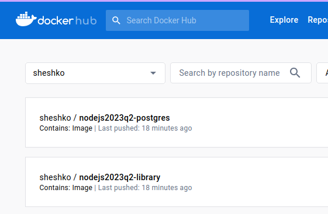

# Home Library Service
Hello! I have pushed my application to DockerHub, so you can start my app without postgres installation to your computer

Actually, all that you must to do - this is add **.env** file and run command **docker compose up**



## Prerequisites

- Git - [Download & Install Git](https://git-scm.com/downloads).
- Node.js - [Download & Install Node.js](https://nodejs.org/en/download/) and the npm package manager.

## Downloading

```
git clone https://github.com/SheshkoPavel/nodejs2023Q2-service.git
```

## Change branch
```
git checkout feature/containerization-database-orm
```

## Installing NPM modules

```
npm install
```

## Add .env file
```
Create .env file in root of project
Clone everything from .env.example into .env
```
## Running application (simple start)

```
npm start
```

## Running application (start using Docker)
This action must download my docker image from docker hub and run application in containers

```
docker compose up
```

## Troubles with DB (migrations)
In some cases can be issues with migration. If it happened - run migration

```
npm run migration:run
```

After starting the app on port (4000 as default) you can open
in your browser OpenAPI documentation by typing http://localhost:4000/docs/.
For more information about OpenAPI/Swagger please visit https://swagger.io/.

## Testing

After application running open new terminal and enter:

To run all tests without authorization

```
npm run test
```

To run only one of all test suites

```
npm run test -- <path to suite>
```

To run all test with authorization

```
npm run test:auth
```

To run only specific test suite with authorization

```
npm run test:auth -- <path to suite>
```

### Auto-fix and format

```
npm run lint
```

```
npm run format
```

### Debugging in VSCode

Press <kbd>F5</kbd> to debug.

For more information, visit: https://code.visualstudio.com/docs/editor/debugging
